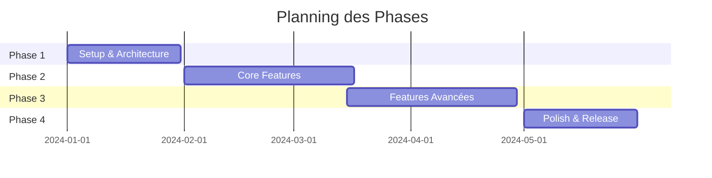

# 🗺️ NotaBene - Roadmap d'Implémentation

## 📋 Vue d'ensemble des phases



## 🎯 Phase 1: Setup & Architecture (4 semaines)

### 1.1 Infrastructure (2 semaines)
- Branch: `feature/NOT-001-project-setup`
  ```
  develop → feature/NOT-001-project-setup → develop
  ```
- Tasks:
  - [ ] Setup Spring WebFlux
  - [ ] Setup Vue.js 2 + Element UI
  - [ ] Configuration MongoDB
  - [ ] Docker setup
  - [ ] CI/CD initial setup

### 1.2 Authentication (2 semaines)
- Branch: `feature/NOT-002-auth-system`
  ```
  develop → feature/NOT-002-auth-system → develop
  ```
- Tasks:
  - [ ] JWT implementation
  - [ ] Login/Register forms
  - [ ] User roles (admin/user)
  - [ ] Security configuration

## 🎯 Phase 2: Core Features (6 semaines)

### 2.1 Note Management (3 semaines)
- Branch: `feature/NOT-003-note-crud`
  ```
  develop → feature/NOT-003-note-crud → develop
  ```
- Tasks:
  - [ ] Note CRUD operations
  - [ ] Real-time autosave
  - [ ] Markdown support
  - [ ] Basic search

### 2.2 Organization System (3 semaines)
- Branch: `feature/NOT-004-note-organization`
  ```
  develop → feature/NOT-004-note-organization → develop
  ```
- Tasks:
  - [ ] Tags system
  - [ ] Folders/Categories
  - [ ] Filters & Sorting
  - [ ] Advanced search

### First Release (v0.1.0)
```
develop → release/v0.1.0 → main
main → tag v0.1.0
```

## 🎯 Phase 3: Features Avancées (6 semaines)

### 3.1 Collaboration (3 semaines)
- Branch: `feature/NOT-005-collaboration`
  ```
  develop → feature/NOT-005-collaboration → develop
  ```
- Tasks:
  - [ ] Note sharing
  - [ ] Real-time collaboration
  - [ ] Comments system
  - [ ] User mentions

### 3.2 Import/Export (3 semaines)
- Branch: `feature/NOT-006-import-export`
  ```
  develop → feature/NOT-006-import-export → develop
  ```
- Tasks:
  - [ ] PDF export
  - [ ] Markdown export
  - [ ] Bulk import/export
  - [ ] Data backup system

### Second Release (v0.2.0)
```
develop → release/v0.2.0 → main
main → tag v0.2.0
```

## 🎯 Phase 4: Polish & Release (4 semaines)

### 4.1 UI/UX Enhancement (2 semaines)
- Branch: `feature/NOT-007-ui-polish`
  ```
  develop → feature/NOT-007-ui-polish → develop
  ```
- Tasks:
  - [ ] Dark/Light mode
  - [ ] Responsive design
  - [ ] Animations
  - [ ] Performance optimization

### 4.2 Final Features (2 semaines)
- Branch: `feature/NOT-008-final-features`
  ```
  develop → feature/NOT-008-final-features → develop
  ```
- Tasks:
  - [ ] Offline mode
  - [ ] Push notifications
  - [ ] Templates system
  - [ ] Final testing

### Production Release (v1.0.0)
```
develop → release/v1.0.0 → main
main → tag v1.0.0
```

## 🔄 Workflow Git Détaillé

### Création d'une nouvelle fonctionnalité
1. Créer depuis develop:
   ```bash
   git checkout develop
   git pull origin develop
   git checkout -b feature/NOT-XXX-description
   ```

2. Développement avec commits réguliers:
   ```bash
   git commit -m "feat(NOT-XXX): description"
   git push origin feature/NOT-XXX-description
   ```

3. Merge vers develop:
   ```bash
   # Créer PR sur GitHub
   # Après review et approbation:
   git checkout develop
   git merge --squash feature/NOT-XXX-description
   git push origin develop
   ```

### Création d'une release
1. Créer la branche release:
   ```bash
   git checkout develop
   git checkout -b release/vX.Y.Z
   ```

2. Tests et fixes:
   ```bash
   # Si fix nécessaire:
   git commit -m "fix(release): description"
   ```

3. Merge vers main et develop:
   ```bash
   git checkout main
   git merge release/vX.Y.Z --no-ff
   git tag vX.Y.Z
   git push origin main --tags
   
   git checkout develop
   git merge release/vX.Y.Z --no-ff
   git push origin develop
   ```

### Hotfix en production
1. Créer depuis main:
   ```bash
   git checkout main
   git checkout -b hotfix/NOT-XXX-description
   ```

2. Fix et tests:
   ```bash
   git commit -m "fix(NOT-XXX): description"
   ```

3. Merge vers main et develop:
   ```bash
   git checkout main
   git merge hotfix/NOT-XXX-description --no-ff
   git tag vX.Y.Z+1
   git push origin main --tags
   
   git checkout develop
   git merge hotfix/NOT-XXX-description --no-ff
   git push origin develop
   ```

## 📊 Points de Contrôle

### Avant chaque merge vers develop:
- [ ] Tests unitaires passants
- [ ] Tests d'intégration passants
- [ ] Code review approuvée
- [ ] Documentation mise à jour
- [ ] Pas de conflits

### Avant chaque release:
- [ ] Tests E2E passants
- [ ] Performance validée
- [ ] Documentation complète
- [ ] Changelog mis à jour
- [ ] Version bumped

## 🚨 Gestion des Urgences

### En cas de bug en production:
1. Créer un hotfix immédiatement
2. Priorité sur toutes autres tâches
3. Double review obligatoire
4. Tests complets avant merge

### En cas de retard:
1. Réévaluer le scope
2. Prioriser les features critiques
3. Reporter les features non-essentielles
4. Communiquer les changements 